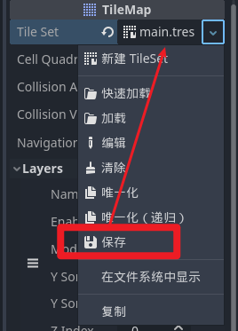

<PageHeader content="如何在不同的场景下，共享同一份图块集资源？" />

我们可以将图块集资源保存为单独的`.tres`文件，这样，就能在不同的场景中使用了。

::: danger 在 Godot 中，.tres 文件是干什么的？
在 Godot 中，.tres 文件是资源引用文件，用于保存资源的引用和属性设置。这些文件通常用于保存场景中的资源引用，例如节点之间的连接和属性设置。这种文件格式使得资源的引用和设置可以在不同场景之间共享和重用。
:::
