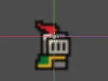
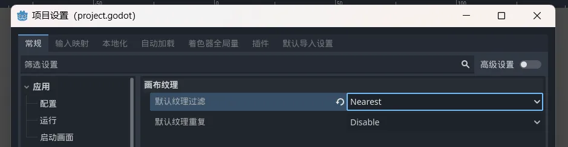
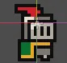

<PageHeader content="如何解决 2d 游戏中像素精灵模糊的问题？" />

::: danger 纹理过滤算法：Nearest（最近邻）和 Linear（线性）

1. Nearest（最近邻）：Nearest 过滤算法会选择距离渲染像素最近的纹理像素作为结果。它会产生像素块效应，因为它直接使用最近的纹理像素，而不进行平滑处理。这种过滤算法适用于像素艺术风格的游戏或需要保留像素级细节的情况。

2. Linear（线性）：Linear 过滤算法会根据渲染像素周围的纹理像素进行插值计算，以获得平滑的过渡效果。它会在纹理像素之间进行插值，以产生更平滑的渲染结果。这种过滤算法适用于需要平滑渲染的情况，如纹理贴图或模糊效果。

:::
